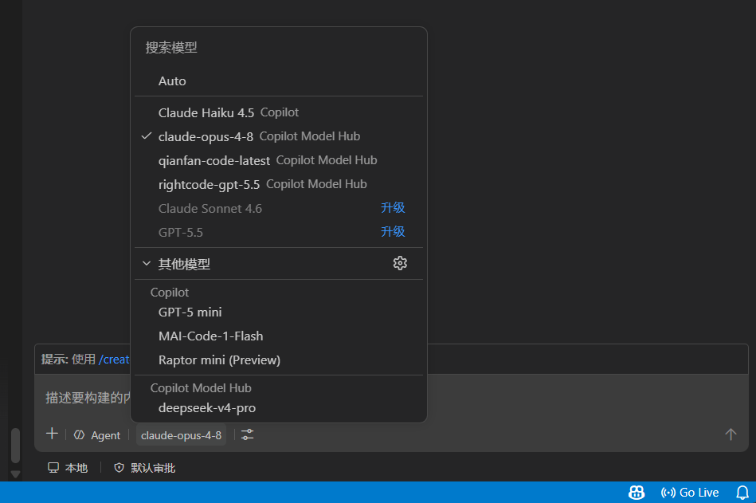

# Copilot Model Hub

English | [简体中文](README.zh-CN.md)



Bring your own models into the **GitHub Copilot Chat** model picker. Configure any OpenAI, Anthropic, or compatible-gateway endpoint as a connection, and it shows up as a selectable model in Copilot Chat. Keys are stored in VS Code SecretStorage, never in settings.

Supports three upstream protocols: `chat` (OpenAI Chat Completions compatible — DeepSeek, OpenRouter, gateways, etc.), `responses` (OpenAI Responses API), and `anthropic` (Anthropic Messages). Streaming, tool calls, and thinking/reasoning all work.

## Quick start

**1. Add a connection** — open your user settings JSON (Command Palette → `Preferences: Open User Settings (JSON)`) and add:

```jsonc
"copilotModelHub.connections": [
  // chat — any OpenAI Chat Completions compatible endpoint (DeepSeek, OpenRouter, gateways…)
  {
    "id": "deepseek",
    "name": "DeepSeek",
    "protocol": "chat",
    "baseUrl": "https://api.deepseek.com",
    "model": "deepseek-chat"
  },
  // responses — OpenAI Responses API (or any Responses-compatible endpoint)
  {
    "id": "gpt5",
    "name": "GPT-5",
    "protocol": "responses",
    "baseUrl": "https://api.openai.com/v1",
    "model": "gpt-5"
  },
  // anthropic — Anthropic Messages API (or any Messages-compatible endpoint)
  {
    "id": "claude",
    "name": "Claude",
    "protocol": "anthropic",
    "baseUrl": "https://api.anthropic.com",
    "model": "claude-opus-4-8"
  },
  // any third-party provider — just point baseUrl/model at their docs and pick the protocol
  {
    "id": "my-provider",
    "name": "My Provider",
    "protocol": "chat",
    "baseUrl": "https://your-provider.example.com/v1",
    "model": "any-model-name"
  }
]
```

Each entry becomes a separate model in the picker — add only the ones you need. Any endpoint that speaks one of the three protocols works; just set `protocol`, `baseUrl`, and `model` accordingly.

> **💡 Set `context` to your model's real size.** Leave it out and it defaults to ~136K (that's the number you see in the picker). This number won't actually cut off your input, but Copilot uses it to decide how much to pack into the chat. So: if your model is bigger (200K, 1M) and you skip this, Copilot only packs to 136K and you waste that extra room; if it's smaller (say only 64K) and Copilot still packs to 136K, the upstream API errors out. Just fill in your model's real size:
>
> ```jsonc
> { "id": "claude", "name": "Claude", "protocol": "anthropic",
>   "baseUrl": "https://api.anthropic.com", "model": "claude-opus-4-8",
>   "context": { "input": 200000, "output": 32000 } }   // input = context window, output = max per reply
> ```

**2. Set the key** — Command Palette → **Copilot Model Hub: Set API Key** → pick the connection → paste the key.

**3. Use it** — open Copilot Chat and select your connection in the model picker. Connections without a key show ⚠️ `API key required`.

> Requires VS Code ≥ 1.116 with GitHub Copilot Chat installed and signed in.

## Configuration fields

| Field | Required | Description |
| --- | --- | --- |
| `id` | yes | Unique id matching `^[a-z0-9][a-z0-9._-]*$` (starts with a letter/digit). |
| `name` | yes | Display name in the model picker. |
| `protocol` | yes | `chat`, `responses`, or `anthropic`. |
| `baseUrl` | yes | Provider base URL, including the full path (e.g. `/v1`). See below. |
| `model` | yes | Upstream model name, sent as-is. |
| `secretKey` | no | SecretStorage key for the API key, defaults to `copilotModelHub.connection.{id}.apiKey`. Point multiple connections at the same one to share a key. |
| `headers` | no | Extra request headers. |
| `capabilities` | no | `{ tools, vision, thinking }`; `tools` on by default, the rest off. |
| `context` | no | `{ input, output }` token limits. |
| `request` | no | `{ temperature, topP, maxTokens, timeoutMs, maxRetries }` defaults. |
| `thinking` | no | Reasoning config, used only when `capabilities.thinking: true`. |

### About baseUrl and `/v1`

Enter it exactly as your provider's docs show — the extension only strips a trailing slash, it doesn't add or remove path segments. Conventions vary: OpenAI uses `/v1`, DeepSeek uses the bare domain, some gateways use custom paths.

`anthropic` is the exception: to match Claude Code, `/v1` is inserted automatically when `baseUrl` doesn't already end with it, so both with and without `/v1` resolve to `…/v1/messages`.

### Enable thinking/reasoning

Set `capabilities.thinking: true` and provide the matching `thinking` object:

```jsonc
"thinking": { "type": "deepseek", "defaultEffort": "high" }              // chat
"thinking": { "type": "openai-reasoning", "defaultEffort": "medium" }    // responses
"thinking": { "type": "anthropic-thinking", "defaultBudgetTokens": 12000 } // anthropic
```

An effort of `none`/`off`/`0` disables reasoning for that request.

## Examples

```jsonc
// OpenAI Responses
{ "id": "gpt5", "name": "GPT-5", "protocol": "responses",
  "baseUrl": "https://api.openai.com/v1", "model": "gpt-5",
  "capabilities": { "thinking": true },
  "thinking": { "type": "openai-reasoning", "defaultEffort": "medium" } }

// Anthropic
{ "id": "claude", "name": "Claude", "protocol": "anthropic",
  "baseUrl": "https://api.anthropic.com", "model": "claude-opus-4-8" }

// Two connections sharing one key
{ "id": "openai-prod", "name": "OpenAI (prod)", "protocol": "chat",
  "baseUrl": "https://api.openai.com/v1", "model": "gpt-4o", "secretKey": "openai.shared" }
{ "id": "openai-mini", "name": "OpenAI (mini)", "protocol": "chat",
  "baseUrl": "https://api.openai.com/v1", "model": "gpt-4o-mini", "secretKey": "openai.shared" }
```

## Commands

- **Set API Key** — store a key for a connection.
- **Test Connection** — probe reachability and auth (no real chat request). If it reports an HTML page, your `baseUrl` path is probably wrong.
- **Open Connections Settings** — jump to the connections setting.

## Notes

- Models appear in the Copilot Chat panel (including its agent mode); they do not appear in the separate **Agent Sessions** window (that surface only accepts dedicated agent backends).
- Keys live only in SecretStorage — never written to settings or logged. All requests go straight to your configured `baseUrl`; no third-party telemetry.
- Logs are in the **Copilot Model Hub** output channel (View → Output).

## Development

```bash
npm install && npm run compile   # install and build
npm test                         # run tests
npm run package                  # build the .vsix
```

Press **F5** to launch a debug window; run `Developer: Reload Window` after changing config.

## License

MIT
